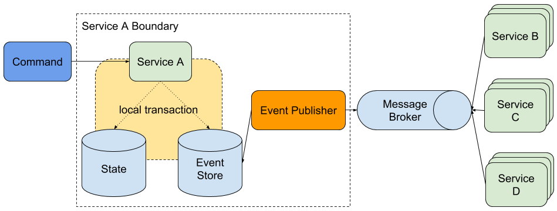

# BASE Demo
I've been recently introduced to BASE (basically available, soft state, eventually consistent) as an alternative to 
doing a full-blown event-sourcing, CQRS style, event-driven architecture.

More information about BASE can be found in this [link](http://bit.ly/ebaybase).

## Core concept



Commands acted on `Service A` will produce `Domain events`. As shown in the diagram, state changes and domain events 

The `Event publisher` will then query the `event store` for events that are `NEW` and attempt to publish those events, 
with data to the appropriate `exchange` or `topic` in the `Message Broker`.

This model allows new services to be created without much coordination from the originating service, the services will only need 
to subscribe to the appropriate `exchange` or `topic` to get the data they need.

## Event store

Currently using RDBMS. What's important is that the `event store` can support transactions so state and event 
persistence are atomic. 

The current schema for the event store is

| id  | event_name | data | state |
| --- | ---------- | ---- | ----- |

- **id** - The event id
- **event_name** - The name of the event `(itemAdded or itermDeleted)`.
- **data** - In this case, the entity as `JSON`
- **state** - The state of the event, whether `NEW` or `PUBLISHED`

**Note:** Adding when the event was created may help in idempotency and/or if event order matters.

## Concerns

- **Rolling back** - If the subscribing service fails to do its purpose, should the publishing service rollback? 
I think this is more a business decision rather than a technical decision. An argument can be made that maybe those 
two services should be one service instead of two.
- **Idempotency** - Subscribers should be built in a way that should events be received more than once will have the 
same result as if the event was only received once.
- **Out or order events** - Some processes require events to be processed in order. Services should be able to 
determine if an event should no longer be processed because it happened prior to the last processed event.

## How to run the project

- This demo uses RabbitMQ as the message broker. A `docker-compose.yml` file with RabbitMQ is included for convenience.
- Default `guest/guest` credentials are used for RabbitMQ. 

1. In the root directory, type `docker-compose up` to start RabbitMQ. (Might need sudo)
2. Run `NotificationServiceApplication.java`
3. Run `ItemApplication.java`
4. Send a `POST` request to `http://localhost:8080/item` with body

    ```json
    {
       "name": "<any string>"
    }
    ```

- To check the contents of the database, go to `http://localhost:8080/h2-console`. The JDBC URL is `jdbc:h2:mem:testdb`. 